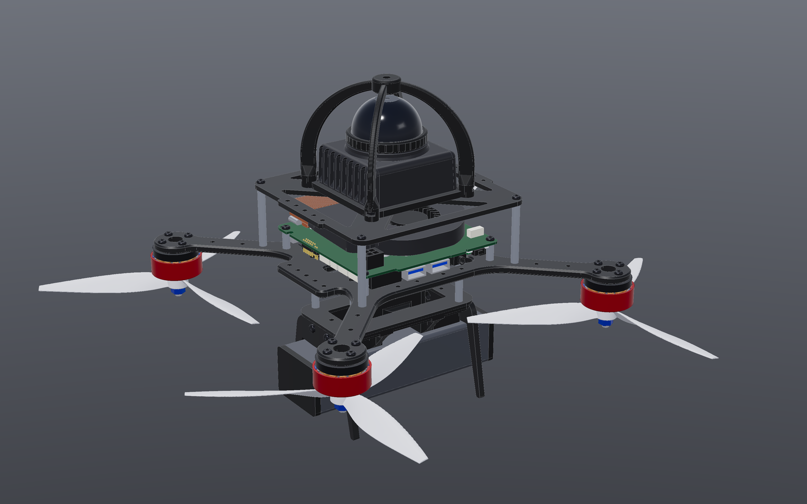

# CustomSuperDrone

Parametric CadQuery models of a [SUPER](https://github.com/hku-mars/SUPER) quadrotor
(HKU MARS) with a Livox Mid-360S LiDAR, an Intel NUC 13 Pro and a 3D printed LiDAR guard.
The scripts build the full drone as a STEP assembly that you can open in a CAD program,
and they export the 3D printed parts as STL files for printing.



## What is in the drone

| Group | Parts |
| --- | --- |
| Frame | SUPER carbon fiber plates (5 mm main, 3 mm top, 2 mm battery), 4 mm carbon feet, M3 aluminum pillars |
| Compute | Intel NUC 13 Pro board on 12 mm standoffs, between the main and top plates |
| Sensing | Livox Mid-360S on the top plate, inside a 3D printed guard |
| Flight stack | 20 x 20 mm flight controller and 4-in-1 ESC under the main plate |
| Power | 6S 3300 mAh LiPo in a 3D printed holder under the battery plate |
| Propulsion | 4 x T-Motor F90 2806.5 with HQProp 7x4x3 props, 280 mm wheelbase |
| Hardware | M3 and M2 button head screws, nuts and nylon spacers |

## Quick start

You need [uv](https://docs.astral.sh/uv/). It installs Python 3.13 and CadQuery on first run.

```sh
uv run python super_drone.py
```

This writes the `super_drone/` folder: one STEP file per part and a top file,
`super_drone/super_drone.step`, that links to them. Open the top file and keep all
files in the same folder. Parts that are used more than once (motors, props, screws)
are one file with many instances.

Fusion 360 does not follow linked STEP files. For Fusion 360, write one file instead:

```sh
uv run python super_drone.py --single-file   # writes super_drone.step
```

Some options:

```sh
uv run python super_drone.py --lidar-yaw 0        # turn the LiDAR (multiples of 90 degrees)
uv run python super_drone.py --no-guard           # without the LiDAR guard
uv run python super_drone.py --no-hardware        # without screws, nuts and spacers
uv run python super_drone.py --motor-detail simple # motors as outer shapes only (lighter in CAD)
uv run python super_drone.py --prop-spec 7x3.5x3  # other props (diameter x pitch x blades, in inches)
uv run python super_drone.py --help               # all options
```

## 3D printed parts

Each of these scripts writes a STEP file and a print-ready STL file:

| Script | Part | Notes |
| --- | --- | --- |
| `lidar_guard.py` | Mid-360S guard: four ribs that arch over the dome | 4 x M3 x 10 screws and nuts on the top plate holes. Needs supports for the arches. PETG or ASA. |
| `battery_holder.py` | Battery holder under the battery plate | Matches `hardware/3DPrinting/battery_board.stl`. M3 nuts in the foot screw traps. |
| `nuc_shield.py` | Ring around the NUC that slides over the pillars | Not in the full drone at the moment. |

```sh
uv run python lidar_guard.py   # writes lidar_guard.step and lidar_guard.stl
```

`lidar_guard.py` also reports how much of the LiDAR field of view the ribs block.

## Files

| File | What it builds |
| --- | --- |
| `super_drone.py` | The full SUPER drone (this README) |
| `lidar_guard.py`, `battery_holder.py`, `nuc_shield.py` | 3D printed parts |
| `mid360s.py` | Livox Mid-360S LiDAR, with an optional FOV solid |
| `nuc13pro.py` | Intel NUC 13 Pro board and CPU cooler, without the case |
| `fcu.py` | Placeholder flight controller (for fit checks) |
| `drone_motor.py` | Brushless outrunner motor: full inner parts, or outer shape only with `--detail simple` |
| `prop.py`, `motor_prop.py` | Propeller with NACA airfoil blades, and motor with prop and nut |
| `drone.py` | A separate generic 5 inch FPV quadcopter |
| `hardware/` | Carbon fiber plate STEP files and the battery holder STL from [SUPER-Hardware](https://github.com/hku-mars/SUPER-Hardware) |

Every script has a `--help` flag, and its docstring describes the part, its
coordinates and its parameters. All sizes are in mm.

In the full drone, X points forward, Y left and Z up. Z = 0 is the bottom face
of the main plate, and the origin is the frame center.

## Credits

The SUPER frame and the battery holder design come from
[hku-mars/SUPER-Hardware](https://github.com/hku-mars/SUPER-Hardware) (MIT license,
see `hardware/LICENSE`).

## License

The code in this repository is under the MIT license, see `LICENSE`. The files in
`hardware/` keep their own MIT license from HKU-Mars-Lab, see `hardware/LICENSE`.
